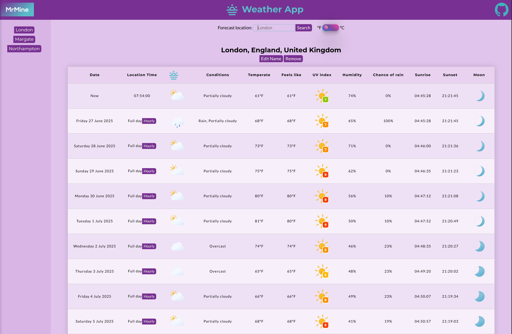

# Weather App

Weather App - A JavaScript project from The Odin Project.

Building from scratch, a Weather app using JavaScript, HTML and CSS.

This project will help me solidify my recent learning of: asynchronous code with promises, using async along with await and working with APIs.

For this project I have used the Visual Crossing API to fetch weather forecasts with their free API key.

You can search for any location in the world (even using latitude and longitude) and my app will initially display a 14 day forecast, with options to display an hourly forecast for each day.

You can also save locations using local storage API, edit names and remove saved locations.

Live Link: https://michael-mine.github.io/odin-weather-app

